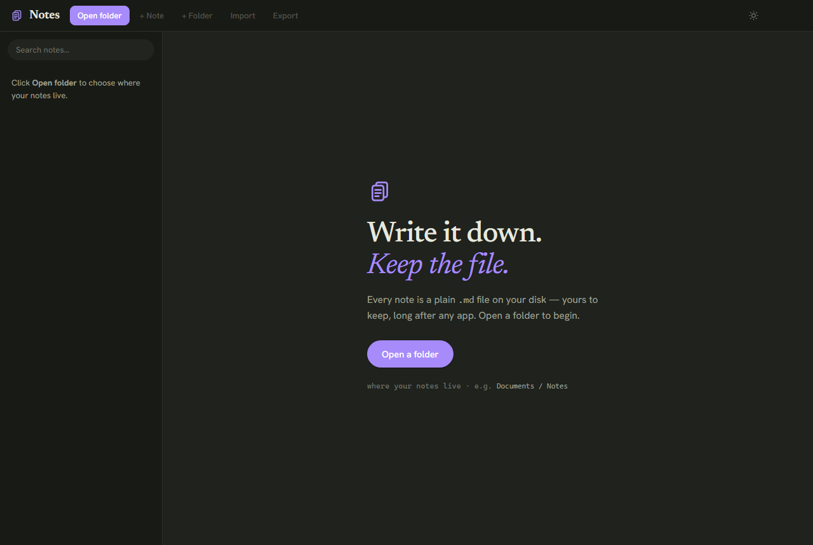
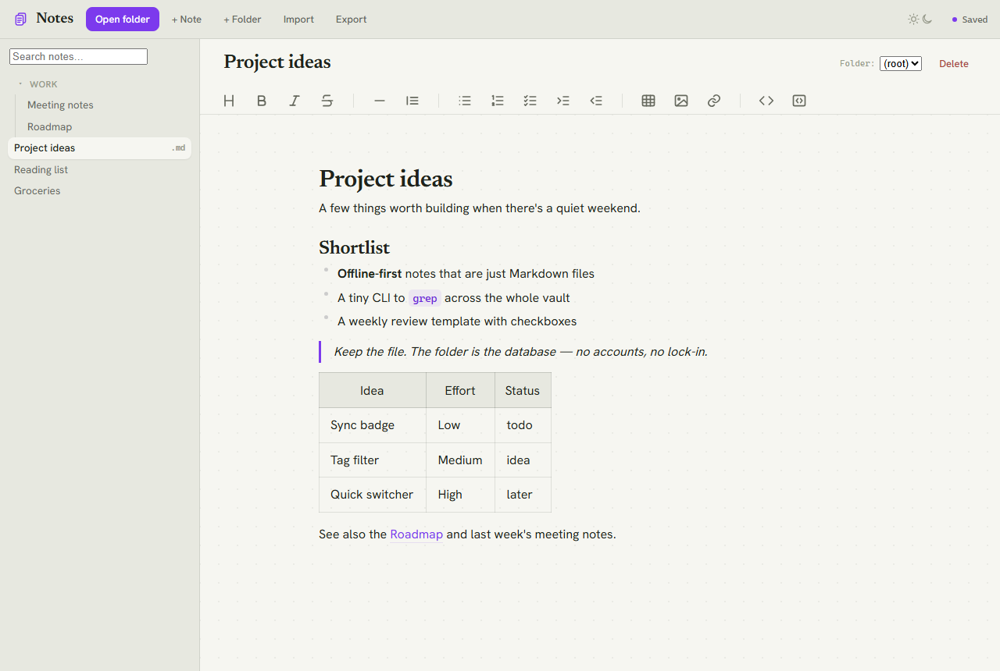

# Markdown Notes

A zero-install, offline notes app that edits **real `.md` files** in a folder you choose. The
folder *is* the database — no accounts, no cloud service, no lock-in. You write in a **WYSIWYG
editor** (formatted text, like Word/Notion — no raw markdown symbols), and everything is saved
as plain Markdown on disk. Built with plain HTML, CSS, and vanilla JavaScript; the only bundled
dependency is the [Toast UI Editor](https://ui.toast.com/tui-editor) (vendored under `vendor/`,
so it still runs fully offline).



*A note open in the WYSIWYG editor (light theme):*



## Requirements

- **Microsoft Edge or Google Chrome** (any recent version).
  The app uses the browser [File System Access API](https://developer.mozilla.org/docs/Web/API/File_System_API)
  to read and write files on disk, which Firefox and Safari do not support.

## How to run

1. Open `index.html` in **Edge** or **Chrome** (double-click it, or right-click → *Open with*).
2. Click **Open folder** and choose where your notes live
   (any folder on your disk, e.g. a `Notes` folder synced by OneDrive/Dropbox).
3. Grant read/write permission when the browser asks.

That's it. The app remembers the folder, so on the next launch you only re-grant permission
with one click ("Reconnect folder").

### Sync across devices with OneDrive

The notes folder you pick can live **inside OneDrive** (or any sync service — Dropbox, Google
Drive Desktop, iCloud Drive). Since every note is a plain `.md` file on disk, OneDrive syncs
them like any other files: edits made on one machine show up on your others automatically, and
you get OneDrive's versioning/backup for free. Just choose a OneDrive-synced folder
(e.g. `OneDrive\Notes`) in the **Open folder** step above — nothing else to configure.

## Desktop shortcut (Windows, optional)

For a one-click launch, you can put a **Notes** shortcut on your Desktop. It runs
`launch-notes.vbs`, which starts a tiny local server (`http://127.0.0.1:8787`) and opens the app
in Chrome's app mode. Serving over `http://localhost` (instead of `file://`) lets Chrome
**remember** the folder permission across launches. Requires Python on PATH (`python -m http.server`).

**Easiest — run the helper script:**

```powershell
powershell -ExecutionPolicy Bypass -File create-shortcut.ps1
```

This creates `Notes.lnk` on your Desktop, pointing at this folder, with the `notes.ico` icon.

**Or do it by hand:**

1. Right-click the Desktop → **New → Shortcut**.
2. For the location, paste (adjust the path to where you cloned the repo):
   `wscript.exe "C:\path\to\Markdown-Notes-editor-\launch-notes.vbs"`
3. Name it **Notes**.
4. Right-click the new shortcut → **Properties**:
   - **Start in:** the repo folder (e.g. `C:\path\to\Markdown-Notes-editor-`)
   - **Change Icon… →** browse to `notes.ico` in the repo folder.

> The original `Notes.lnk` is intentionally **not** committed (it hard-codes an absolute local
> path); generate your own with the steps above.

## Features

- **WYSIWYG editing** — write formatted text directly with a toolbar (bold, italic, headings,
  lists, links, tables, code…); no markdown syntax to type. Saved as Markdown automatically.
- **Real files & folders** — each note is a `.md` file; each folder is a real subdirectory.
- **Autosave** — edits are written back to disk ~0.7 s after you stop typing (status shows
  *Saving… / Saved*). `Ctrl+S` forces a save.
- **Full-text search** — filter the sidebar by note title and content.
- **Organize** — create, rename, move (via the folder dropdown), and delete notes and folders.
- **Import / Export** — bring in external `.md` / `.markdown` / `.txt` files, or download a
  copy of the current note.
- **Light & dark** — follows your OS theme automatically.

### Keyboard shortcuts

| Shortcut   | Action            |
|------------|-------------------|
| `Ctrl + N` | New note          |
| `Ctrl + S` | Save now          |

(Standard formatting shortcuts like `Ctrl + B` / `Ctrl + I` are provided by the editor.)

## Files

| File          | Role                                                                 |
|---------------|----------------------------------------------------------------------|
| `index.html`  | App shell and layout.                                                |
| `styles.css`  | Layout, theming (light/dark), sidebar + editor host.                 |
| `fs.js`       | File System Access layer + handle persistence (`window.FS`).         |
| `app.js`      | UI state, tree rendering, autosave, search, import/export, editor.   |
| `vendor/`     | Bundled Toast UI Editor (`toastui-editor.js` + light/dark CSS).      |

## Verifying changes (manual)

There is no build or test suite — checking the app means opening `index.html` and exercising
the UI. After any change to `app.js` / `fs.js`, run through these scenarios; each one targets a
data-loss or state-corruption bug that has bitten this app before:

1. **Switch notes with a pending edit** — type into note A, then within ~0.7 s click note B.
   B must keep its own content (A's unsaved text must not leak into B), and A must be saved.
2. **Rename, then quickly switch** — edit note A's title, then immediately click note B before
   the rename lands. The rename must apply to **A**, and B must open normally.
3. **Rename a folder containing the open note** — the editor must re-open the same note at its
   new path (not go blank or write to the old, now-deleted location).
4. **Move a note and move it back** — moving to a folder then back to the same folder must be a
   no-op (no `note-2.md` duplicate), and the editor must follow the note to its new location.
5. **Search, then clear it fast** — type a query, then immediately backspace to empty. The full
   tree must stay rendered (a late search result must not overwrite it).
6. **Create a note in a subfolder** — select a subfolder, create a note; the **newly created**
   note must open, even if a same-named note exists elsewhere in the tree.
7. **Close with an unsaved edit** — type, then close the tab within ~0.7 s. The browser should
   prompt before closing so the save can land.

## Notes & limitations

- Editing is WYSIWYG, but storage is plain Markdown. Conversion is handled by the Toast UI
  Editor; very exotic Markdown may round-trip imperfectly.
- Renaming a note rewrites the file under a new name (the API has no atomic rename); the same is
  true for moving notes between folders and renaming folders.
- Because files are plain `.md` on disk, OneDrive (or any sync tool) keeps them in sync across
  devices automatically.

## Credits & licenses

This project's own code is released under the [MIT License](LICENSE) — © 2026 Adou63.

It bundles third-party assets under `vendor/`, which keep their own licenses:

- **[Toast UI Editor](https://github.com/nhn/tui.editor) 3.2.2** — MIT License, © NHN Cloud
  (`vendor/toastui-editor-all.min.js` and its CSS).
- **[Newsreader](https://fonts.google.com/specimen/Newsreader)** and
  **[Hanken Grotesk](https://fonts.google.com/specimen/Hanken+Grotesk)** fonts — SIL Open Font
  License 1.1, via Google Fonts (`vendor/fonts/`).
